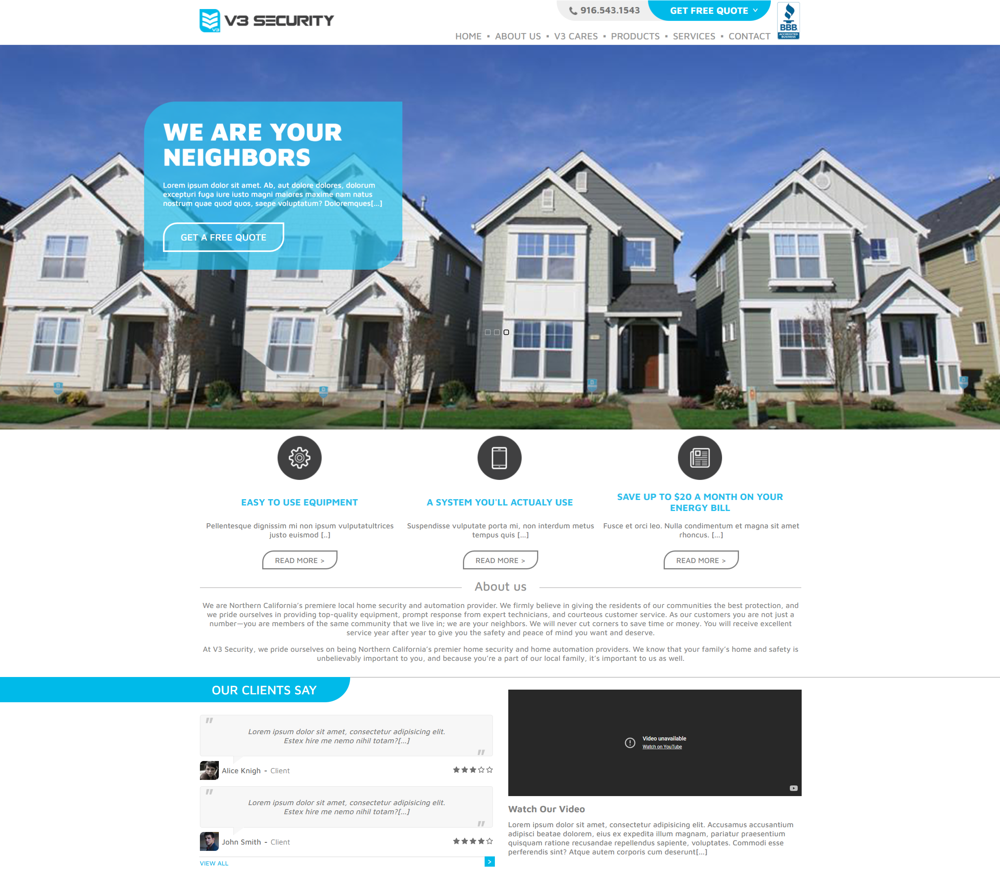

🎉 **V3-Securiy | 1st complete webpage** 🎉

Welcome to my first serious project, where I embarked on a thrilling journey to learn HTML and CSS! 💪✨ (after [MWS](https://github.com/TIPYexe/mws.github.io) and [Meteold](https://github.com/TIPYexe/Meteold))

## Project Overview

The objective was clear: starting from a mere screenshot of an existing website, I challenged myself to recreate it. I relied solely on the powerful combination of MDN documentation and the endless wisdom of Stack Overflow.

Throughout this exciting adventure, I devoted a total of 4 days to bring my vision to life:

### Day 1: Patchwork Beginnings

On the first day, fueled by enthusiasm and a dash of impatience, I dove headfirst into the realm of CSS attributes. Although I may have resorted to some clever patchwork techniques, I successfully managed to complete the navigation section. 🚀

### Day 2: Trials and Tribulations

The second day presented its fair share of challenges. Eager to customize the navigation further, my experimentation led to unintended consequences. The patches I had implemented ended up breaking everything! 😱 With unwavering determination, I battled through the day, meticulously troubleshooting and fixing each issue that arose.

### Day 3: The Clean Slate

Realizing the limitations and drawbacks of my previous patchwork approach, I made a bold decision on the third day. I decided to abandon the old code entirely and embrace a fresh start. Armed with newfound wisdom and a commitment to professionalism, I began the project from scratch. 💼✨

### Day 4: Triumph and Completion

With the finish line in sight, I poured all my efforts into the final day of the project. As the hours ticked by, I meticulously refined every detail, ensuring a polished and visually stunning website. And just like that, the project was done—a testament to my determination and newfound skills. 🎉🎊

## Get Started

To explore my amazing creation, simply clone this repository and open the `index.html` file in your favorite web browser. Get ready to be impressed! Even the testimonials are made with CSS, not pictures 😄🌟

## Acknowledgments

I want to express my heartfelt gratitude to the wonderful resources provided by MDN and the supportive community at Stack Overflow. 🙏❤️
